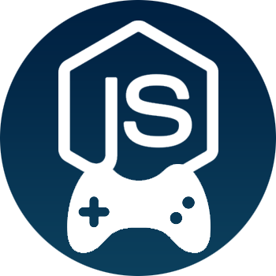

# JSGames v2
A stateless Nodejs game server using Socket.io and Backbone/Marionette.
Currently, Connect Four, Uno, and Exploding Kittens are implemented.

# Local Setup
Developed in node `6.10.0`, npm `4.3.0`.
Run `npm install`, then `npm start`.
For development, run `gulp`.

# To do
- Implement games
  - Dominion
  - Pictionary ?
  - Othello ?
  - Cards against humanity ?
- Add Spectate mode
- Add who's online list to chat
- Add twitch emotes to chat
- Add user avatar (ability to choose animal)

# Bugs
- Cats dancing on certain size screens when playing cards (try using transforms instead of transition)

# Sources/credits
- Sounds taken from free domain.
- Defused sound from Counterstrike
- Nope sound from TF2
- Cat is Pusheen the Cat
