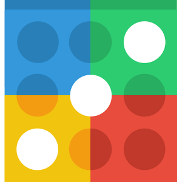
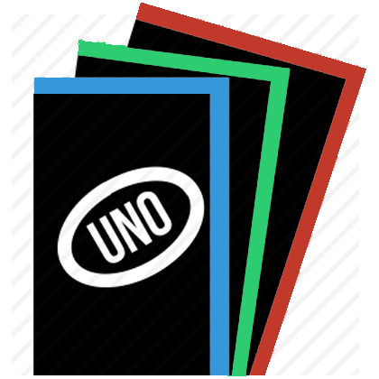
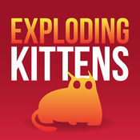
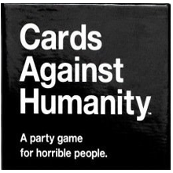

  

# JSGames v2

A stateless Nodejs game server using Socket.io and Backbone/Marionette.
Currently, Connect Four, Uno, Pictionary, Exploding Kittens, and Cards Against Humanity are implemented.

# Local Setup
Developed in node `8.9.0`, npm `5.5.1`.
Run `npm install`, then `npm start`.
For development, run `gulp`.

# To do
- Implement games
  - Dominion
  - Othello ?
  - Blockus
  - Sorry
- Add Spectate mode
- Add who's online list to chat
- Add twitch emotes to chat
- Add user avatar (ability to choose animal)
- Add scoreboard for games

# Bugs
- Cats dancing on certain size screens when playing cards (try using transforms instead of transition)
- Views not responsive in phone browser, chat not closing properly

# Sources/credits
- Sounds taken from free domain.
- Defused sound from Counterstrike
- Nope sound from TF2
- Cat is Pusheen the Cat
